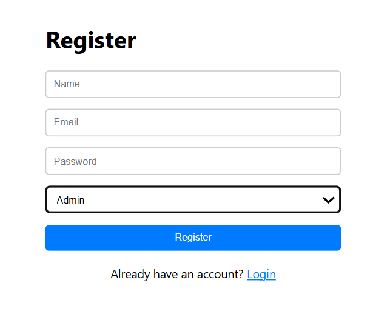
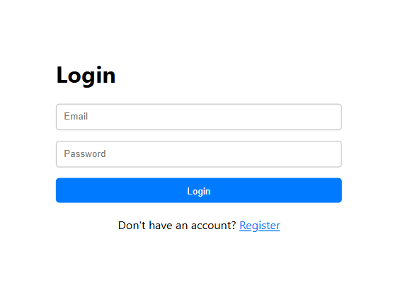
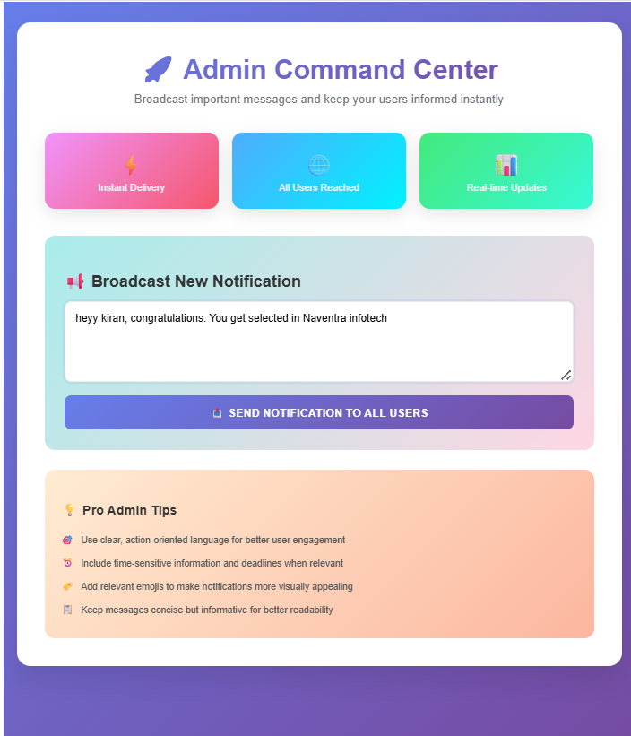
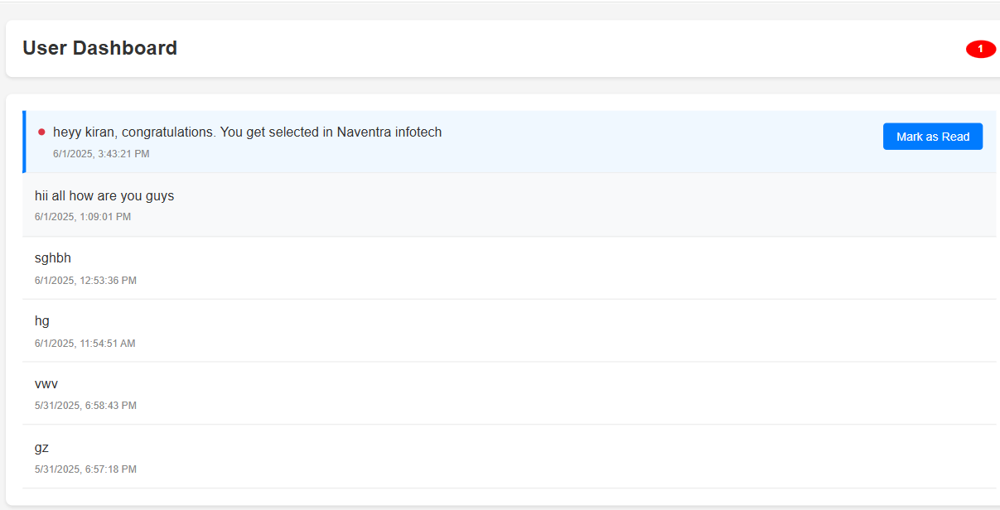

# Notification System

A full-stack MERN application that enables admins to send notifications to users, with real-time read/unread status tracking and badge counters.

 <!-- Add a demo GIF if available -->

## Features

- **Role-based access control**
  - Admin: Create and send notifications
  - User: View and manage notifications
- **Real-time notification tracking**
  - Read/unread status with visual indicators
  - Live badge counter for unread notifications
- **User-friendly interface**
  - Clean dashboard for both admin and user roles
  - Mark-as-read functionality
  - Notification history with timestamps

## Tech Stack

**Frontend:**
- React.js
- Axios for API calls
- React Router for navigation
- CSS for styling

**Backend:**
- Node.js
- Express.js
- MongoDB (with Mongoose)
- JWT for authentication

## Installation

### Prerequisites
- Node.js (v14+)
- MongoDB (local or Atlas cluster)
- Git

### Setup Instructions

1. **Clone the repository**
   ```bash
   git clone https://github.com/yourusername/notification-system.git
   cd notification-system
Backend Setup

bash
cd backend
npm install
Create a .env file in the backend directory:

env
MONGO_URI=mongodb://localhost:27017/notification_app(REPLACE THIS WITH YOUR MONGOBD LOCAL OR ATLAS LINK)
JWT_SECRET=your_jwt_secret_here
PORT=5000
Frontend Setup

bash
cd ../frontend
npm install

Run the Application

In one terminal:

bash
cd backend
npm start
In another terminal:

bash
cd ../frontend
npm start

 register page
(login page)
(Admin page)
(user page)